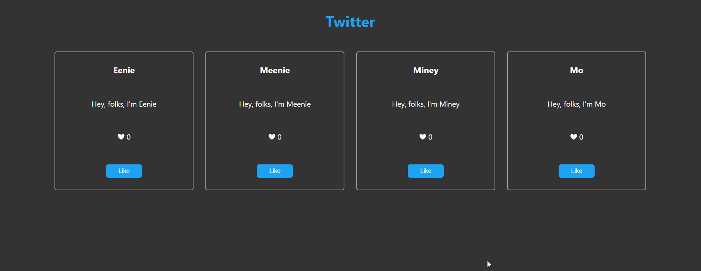

### General Info:

My first React app - made using the following concepts:

- Function & Class components
- Props
- Click events
- State

This project was bootstrapped with [Create React App](https://github.com/facebook/create-react-app).

### To view



### To run

```npm start``` Runs the app in the development mode.
Open [http://localhost:3000](http://localhost:3000) to view it in the browser.